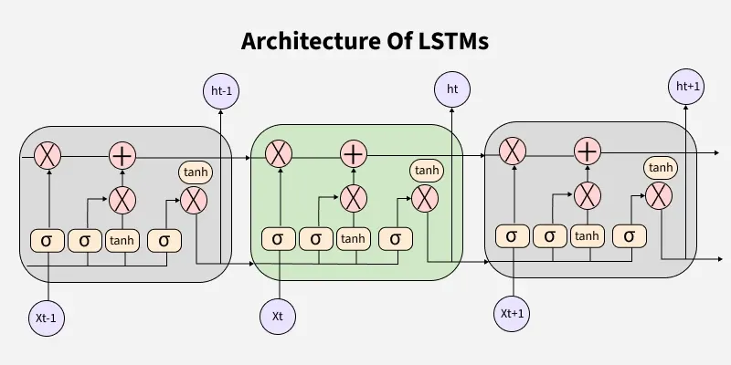
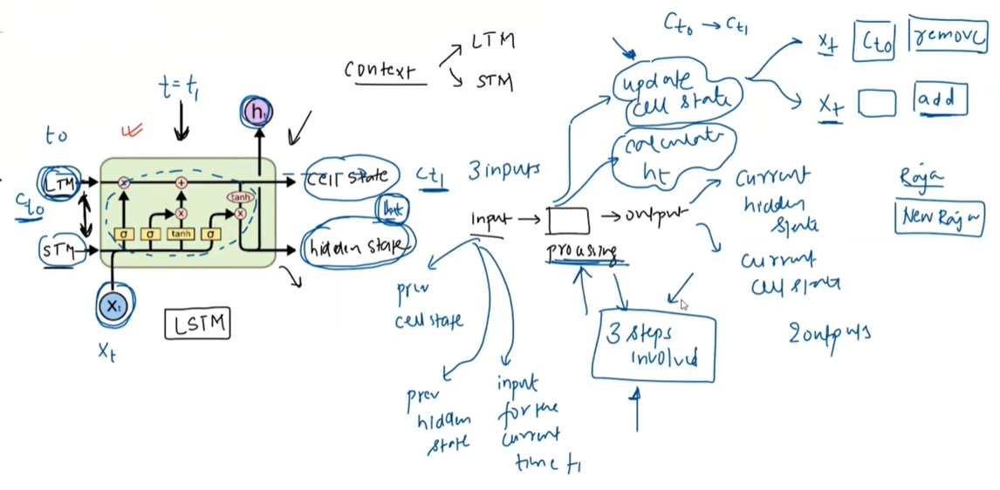
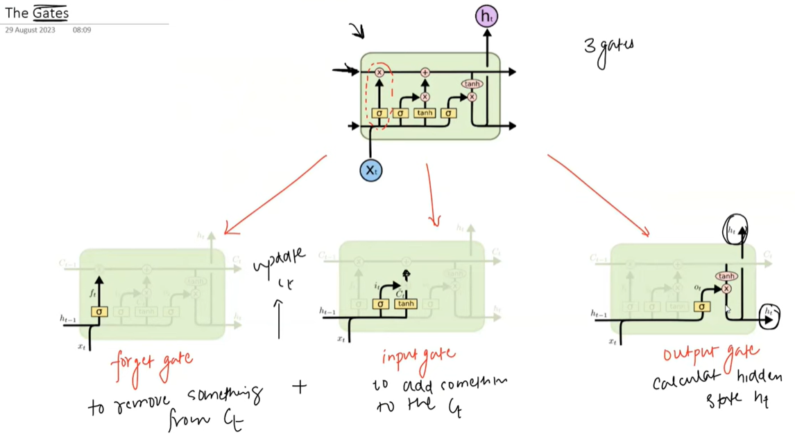
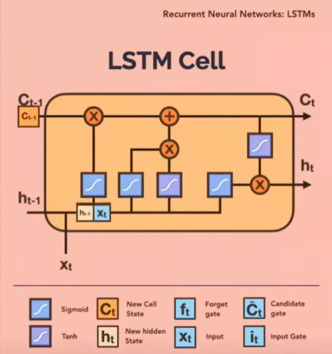
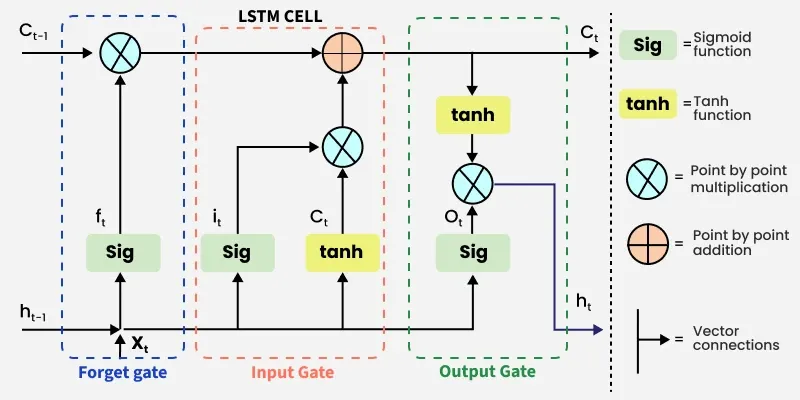

### RNN has two Major Problems:

1️⃣ Vanishing Gradient Problem

During training, gradients are propagated backward through time (BPTT).

In long sequences, gradients are multiplied many times by small numbers (derivatives < 1).As a result:

Gradient→0

🔹 What is the effect?

Earlier time steps learn very slowly.

Model cannot remember long-term dependencies.

Old information fades away.

🔹 Simple intuition

If each step multiplies gradient by 0.5:

After many steps:

0.5×0.5×0.5×...→0

So memory of early inputs disappears.RNN fails to capture long-range relationships.

Example:

In long sentences, the model forgets the beginning.

2️⃣ Exploding Gradient Problem

If gradients are multiplied by large values (>1) repeatedly:
Gradient→ ∞

🔹 What is the effect?

Weights update becomes extremely large

Training becomes unstable

Loss becomes NaN

Model may crash

🔹 Simple intuition

If each step multiplies by 2:

2×2×2×...→very large number

Problem	Cause	Effect:

Vanishing Gradient	Repeated multiplication by small numbers	Model forgets long-term info

Exploding Gradient	Repeated multiplication by large numbers	Training becomes unstable

✅ Solutions

LSTM / GRU (reduce vanishing gradient)

Gradient clipping (prevent exploding gradient)

Vanishing gradient makes learning very slow for early time steps, while exploding gradient makes training unstable due to very large updates.

### 1.LSTM - Long Short-Term Memory

A special RNN that can remember information for LONG periods.

**The 3 Gates Explained**

LSTM has 3 gates controlling memory flow:

1. 🚪 FORGET GATE: "What to throw away?" Controls what information is added to the memory cell.
   
   - Looks at old memory
   - Decides what's not important

2. 🚪 INPUT GATE: "What new info to store?" Determines what information is removed from the memory cell.

   
   - Looks at new input
   - Decides what to add to memory

3. 🚪 OUTPUT GATE: "What to output now?"Controls what information is output from the memory cell.
   
   - Looks at current memory
   - Decides what to use for prediction

**Two Types of Memory**

CELL STATE = Long-term memory (highway)

- Carries information through many steps
- Changes slowly, only when important

HIDDEN STATE = Short-term/working memory  

- Used for current prediction
- Updates at every step

**Real Example: "I grew up in France... I speak French"**

Simple RNN: Forgets "France" by the end.

LSTM:

Step 1: "France" → Input Gate: "Important!" → Store in CELL STATE

Step 2: many words → Forget Gate: "Keep France!" → Cell State unchanged

Step 3: "I speak" → Output Gate: "Use France from Cell" → Predict "French".

### 2.LSTM Architecture

### 3.Working of LSTM

LSTM architecture has a chain structure that contains four neural networks and different memory blocks called cells.

At each time step, LSTM computes four things:

Forget Gate

Input Gate

Candidate Memory

Output Gate

Each of these is a small neural network.

### For more details and visualization of LSTM go to this link:

https://www.geeksforgeeks.org/deep-learning/deep-learning-introduction-to-long-short-term-memory/

