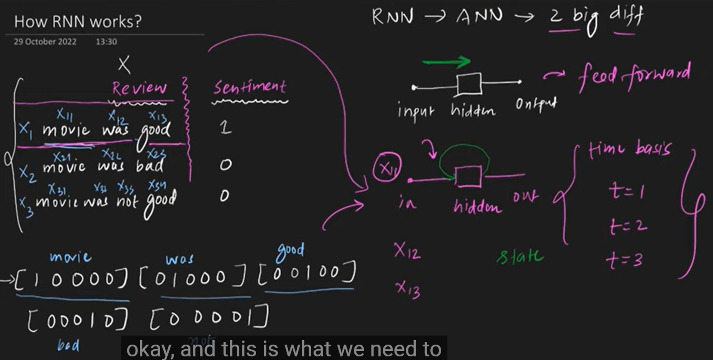
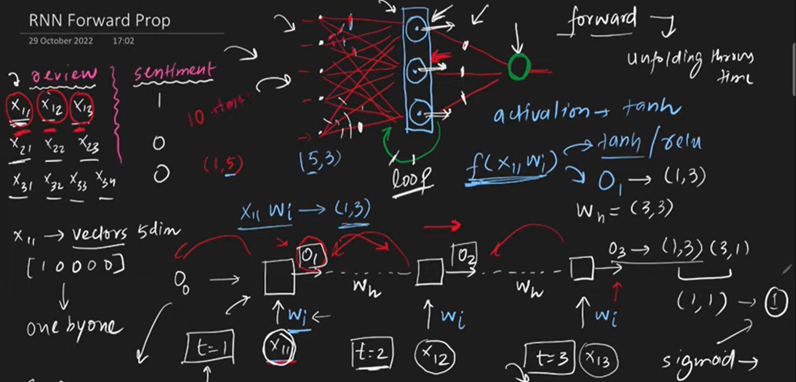
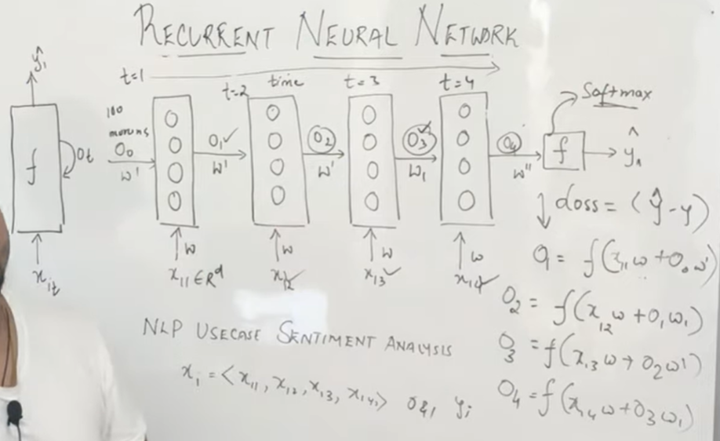

# Architecture of RNN
**Goal**

1. RNN Architecture
2. RNN forward propagation
3. How to predict output from input

### why we can't handle sequential data with ANN?
ANN cannot properly handle sequential data because it processes inputs independently and has no memory of previous inputs. Sequential data requires context from earlier time steps, which ANN cannot capture. 

Problem:

1.text input--> varying size

2.Zero padding-->unnecessary computation

3.Prediction problem

4.sequence info are lost

1️⃣ No memory

A standard ANN (feedforward neural network) processes each input independently.

It does:
y=f(wx+b)

It only looks at the current input x.

It does NOT remember previous inputs.

2️⃣ Sequential data needs context

In sequential data (like text or time series),
the current element depends on previous ones.

Example:

“I love deep learning”

To understand “learning”,
the model needs to remember “I love deep”.

ANN cannot remember previous words.

2️⃣ Sequential data needs context

In sequential data (like text or time series),
the current element depends on previous ones.

Example:

“I love deep learning”

To understand “learning”,
the model needs to remember “I love deep”.

ANN cannot remember previous words.

**ANN feed forwarded but RNN not**

ANN vs RNN (Feedforward difference)

ANN = Feedforward Network

-> Data moves in one direction only

-> Input → Hidden → Output

-> No loops

-> No memory of previous inputs

-> Output depends only on current input.

RNN = Not Purely Feedforward

-> Has a loop (recurrence)

-> Uses previous hidden state

-> Keeps memory of past inputs

h(t) =f(xt*Wih + h(t-1)*Whh)

Output depends on current input and previous hidden state.

ANN: Feedforward network, no memory, processes inputs independently.

RNN: Recurrent network, has feedback loop, remembers previous information.

**Data Input style**

[(timesteps,input feutures)] 

In this format we gave input.
For first word t=1

2nd word t=2.....

if vocab=5 then for one sentence "movie was good"

the input will be (3,5) where 3=total timesteps,

5=every vector size such as 

movie=[1,0,0,0,0]

was=[0,1,0,0,0].........

suppose data exists:

          Review                      Sentiment

 x1    movie was good                    1   

 x2    movie was bad                     0

 x3    movie was not good                0

 structure is:  input-------->Recurrrent hidden---------->output.
 
 difference is that we can't feed whole input at the same time.we send one by one(movie,was.....) according to timestep.

 

### How forward propagation works in RNN?

Moving data from INPUT → HIDDEN → OUTPUT to make a prediction!

# Each word goes through the same process:

Step 1: "I"      → [hidden1] → prediction? (not used)

Step 2: "love"   → [hidden2] (using hidden1's memory)

Step 3: "AI"     → [hidden3] (using hidden2's memory) → FINAL OUTPUT

**At EACH time step (word):**

# FORMULA:

hidden_t = activation( input_t @ W_ih + hidden_{t-1} @ W_hh + bias )

output_t = hidden_t @ W_ho + bias_out

Where:

input_t = current word embedding

hidden_{t-1} = previous hidden state (memory)

W_ih, W_hh, W_ho = weights (learned parameters)

@ = matrix multiplication

**Visualization**

START: hidden_0 = [0, 0, 0] (initial memory = empty)

TIME STEP 1: "I"

input_1 = [0.1, 0.2, 0.3]  # embedding for "I"

hidden_1 = tanh( input_1 @ W_ih + hidden_0 @ W_hh )

hidden_1 now = [0.4, 0.5, 0.6] ← remembers "I"

output_1 = hidden_1 @ W_ho  # (not used for final)

TIME STEP 2: "love"

input_2 = [0.4, 0.5, 0.6]  # embedding for "love"

hidden_2 = tanh( input_2 @ W_ih + hidden_1 @ W_hh )

hidden_2 = [0.7, 0.8, 0.9] ← remembers "I love"

output_2 = hidden_2 @ W_ho  # (not used for final)

TIME STEP 3: "AI"

input_3 = [0.7, 0.8, 0.9]  # embedding for "AI"

hidden_3 = tanh( input_3 @ W_ih + hidden_2 @ W_hh )

hidden_3 = [0.2, 0.3, 0.4] ← remembers "I love AI"

output_3 = hidden_3 @ W_ho  # ← FINAL PREDICTION!

FINAL OUTPUT: scores for next word (if training)

[0.1, 0.2, 0.7, 0.1, ...]

