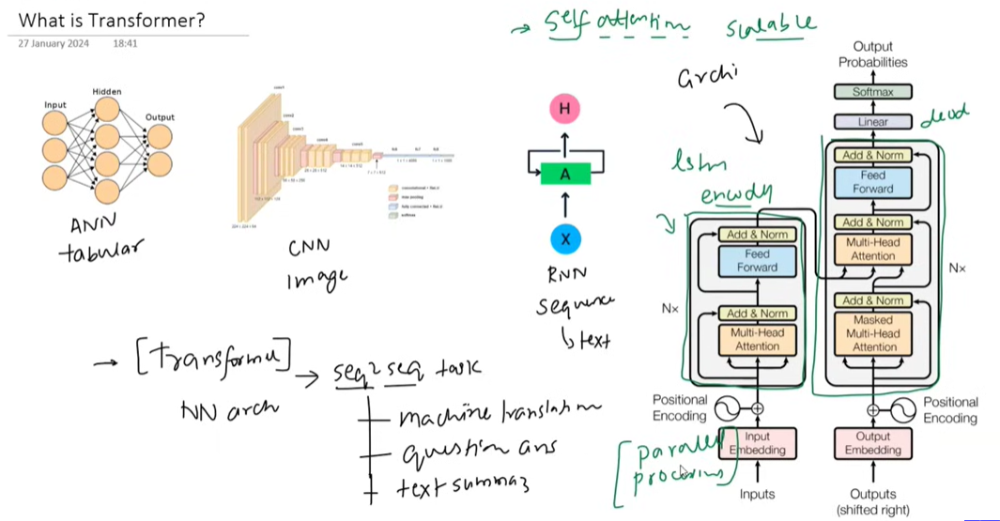

# Transformer Basics

## What is a Transformer?

A **Transformer** is a deep learning architecture designed to process **sequence data** (such as text, time series, or signals).
Instead of processing tokens sequentially like RNNs or LSTMs, a transformer processes the entire sequence at once using an attention mechanism.

## Why Do We Need Transformers?

The Transformer was introduced in 2017 by Vaswani et al. to solve RNN/LSTM limitations. Unlike sequential models, it uses self-attention and 
parallel processing to capture long-distance dependencies efficiently. Its encoder-decoder architecture allows understanding input and generating output simultaneously. Transformers are faster, handle large datasets, and capture global context for each word, making them the backbone of modern NLP models like BERT and GPT.

Earlier sequence models (RNN, LSTM, GRU) had some limitations:

* **Sequential processing** → slow training
  
* **Difficulty capturing long-range dependencies**
* 
* **Gradient problems** in long sequences

Transformers solve these problems using **attention**, allowing the model to look at **all tokens simultaneously** and learn relationships between them efficiently.

## What we will learn:

### 1. Self Attention

A mechanism where each token in a sequence attends to every other token to capture relationships and context.

### 2. Scaled Dot Product Attention

The mathematical computation used to calculate attention weights using **Query, Key, and Value vectors**.

### 3. Self Attention Geometric Intuition

Understanding attention through vector similarity and dot products in vector space.

### 4. Positional Encoding

Since transformers process tokens in parallel, positional encoding is added so the model can understand token order.

### 5. Layer Normalization

A normalization technique that stabilizes and speeds up training inside transformer layers.

### 6. Encoder Architecture

The encoder processes the input sequence using:

* self attention
  
* feed-forward networks
  
* normalization and residual connections

### 7. Masked Self Attention

Used in the decoder to prevent a token from seeing future tokens during training.

### 8. Cross Attention

Allows the decoder to attend to encoder outputs, connecting input information with generated outputs.

### 9. Decoder Architecture

The decoder generates outputs step by step using:

* masked self attention
* cross attention
* feed-forward layers

### 10. Transformer Inference

The process of generating outputs (e.g., predicting the next token) during model usage after training.

